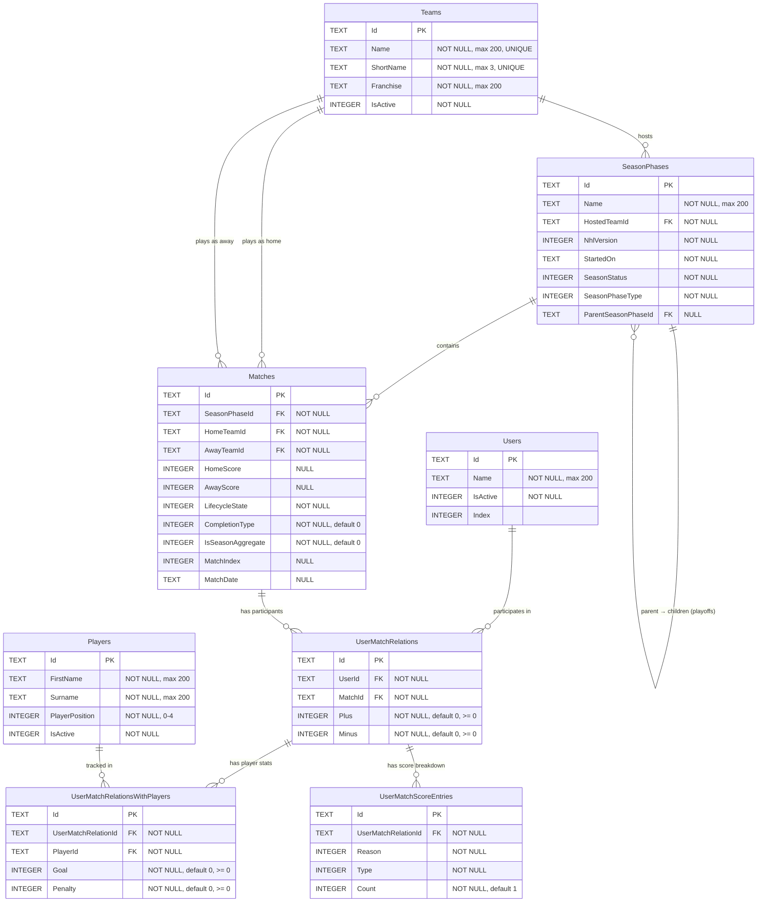

# NHLStats Database Schema Documentation

> **Database Engine:** SQLite  
> **ORM:** Entity Framework Core  
> **Last updated:** 2026-03-01 (migration 022)

---

## Table of Contents

1. [ER Diagram](#er-diagram)
2. [Tables](#tables)
   - [Users](#users)
   - [Teams](#teams)
   - [SeasonPhases](#seasonphases)
   - [Players](#players)
   - [Matches](#matches)
   - [UserMatchRelations](#usermatchrelations)
   - [UserMatchRelationsWithPlayers](#usermatchrelationswithplayers)
   - [UserMatchScoreEntries](#usermatchscoreentries)
3. [Views](#views)
   - [UserSeasonStats](#userseasonstats-view)
   - [UserWeeklyStats](#userweeklystats-view)
4. [Enums](#enums)
5. [Business Rules](#business-rules)
6. [Migration History](#migration-history)

---

## ER Diagram



---

## Tables

### Users

**Purpose:** Stores the participants (players/users) who play NHL video game matches and track their plus/minus statistics.

| Column | Type | Constraints | Description |
|--------|------|------------|-------------|
| `Id` | TEXT (GUID) | PRIMARY KEY | Unique identifier |
| `Name` | TEXT | NOT NULL, max 200 chars | User's display name |
| `IsActive` | INTEGER (bool) | NOT NULL | Whether the user is currently active |
| `Index` | INTEGER | — | Display order index for the user |

**Indexes:**

| Index Name | Columns | Unique |
|-----------|---------|--------|
| `IX_Users_IsActive` | `IsActive` | No |

---

### Teams

**Purpose:** Stores all 32 NHL teams with their full names, 3-letter abbreviations, and franchise information.

| Column | Type | Constraints | Description |
|--------|------|------------|-------------|
| `Id` | TEXT (GUID) | PRIMARY KEY | Unique identifier |
| `Name` | TEXT | NOT NULL, max 200 chars, UNIQUE | Team's full name (e.g., "Colorado Avalanche") |
| `ShortName` | TEXT | NOT NULL, max 3 chars, UNIQUE | Team's abbreviation (e.g., "COL") |
| `Franchise` | TEXT | NOT NULL, default `''` | Franchise name or location |
| `IsActive` | INTEGER (bool) | NOT NULL | Whether the team is currently active |

**Indexes:**

| Index Name | Columns | Unique |
|-----------|---------|--------|
| `UX_Teams_Name` | `Name` | Yes |
| `UX_Teams_ShortName` | `ShortName` | Yes |
| `IX_Teams_IsActive` | `IsActive` | No |
| `IX_Teams_ShortName` | `ShortName` | No |

---

### SeasonPhases

**Purpose:** Represents a season phase — either a regular season or a playoff phase. Supports parent-child self-referencing: a regular season (parent) can have one or more playoff phases (children). Each season phase is hosted by a specific team and tied to an NHL game version.

| Column | Type | Constraints | Description |
|--------|------|------------|-------------|
| `Id` | TEXT (GUID) | PRIMARY KEY | Unique identifier |
| `Name` | TEXT | NOT NULL, max 200 chars | Descriptive season name (e.g., "Season 4") |
| `HostedTeamId` | TEXT (GUID) | NOT NULL, FK → Teams(Id), ON DELETE CASCADE | The team hosting this season |
| `NhlVersion` | INTEGER | NOT NULL | NHL game version enum (22, 23, 24, 26) |
| `StartedOn` | TEXT (ISO 8601) | NOT NULL | Season start date |
| `SeasonStatus` | INTEGER | NOT NULL | Status: 0=Active, 1=Completed, 2=Cancelled |
| `SeasonPhaseType` | INTEGER | NOT NULL, default 0 | Type: 0=Regular, 1=Playoff, 2=Both |
| `ParentSeasonPhaseId` | TEXT (GUID) | NULL, FK → SeasonPhases(Id), ON DELETE RESTRICT | Parent season (for playoff phases) |

**Indexes:**

| Index Name | Columns | Unique |
|-----------|---------|--------|
| `IX_SeasonPhases_HostedTeamId` | `HostedTeamId` | No |
| `IX_SeasonPhases_StartedOn` | `StartedOn` | No |
| `IX_SeasonPhases_SeasonStatus` | `SeasonStatus` | No |
| `IX_SeasonPhases_SeasonPhaseType` | `SeasonPhaseType` | No |
| `IX_SeasonPhases_ParentSeasonPhaseId` | `ParentSeasonPhaseId` | No |

**Relationships:**

| Relationship | Target | Type | Cascade |
|-------------|--------|------|---------|
| `HostedTeamId` → `Teams.Id` | Teams | Many-to-One | CASCADE |
| `ParentSeasonPhaseId` → `SeasonPhases.Id` | Self | Many-to-One (self-ref) | RESTRICT |

---

### Players

**Purpose:** Stores player entities used in NHL matches. Players are assigned a hockey position and tracked for goals/penalties within user match relations.

| Column | Type | Constraints | Description |
|--------|------|------------|-------------|
| `Id` | TEXT (GUID) | PRIMARY KEY | Unique identifier |
| `FirstName` | TEXT | NOT NULL, max 200 chars | Player's first name |
| `Surname` | TEXT | NOT NULL, max 200 chars | Player's surname |
| `PlayerPosition` | INTEGER | NOT NULL, CHECK (0–4) | Hockey position enum |
| `IsActive` | INTEGER (bool) | NOT NULL, default 1 | Whether this player is active |

**Indexes:**

| Index Name | Columns | Unique |
|-----------|---------|--------|
| `IX_Players_IsActive` | `IsActive` | No |

> **Note:** The `PlayerTeamSeasonRelations` table was dropped in migration 018. Players are no longer tied to teams/seasons via a junction table. The `YearOfBirth`, `CreatedAt`, and `UpdatedAt` columns were also removed in the same migration.

---

### Matches

**Purpose:** Represents a game between two NHL teams within a season phase. Supports both real matches and "season aggregate" matches that summarize an entire season. Tracks scores, lifecycle state, completion type, sequencing, and date.

| Column | Type | Constraints | Description |
|--------|------|------------|-------------|
| `Id` | TEXT (GUID) | PRIMARY KEY | Unique identifier |
| `SeasonPhaseId` | TEXT (GUID) | NOT NULL, FK → SeasonPhases(Id), ON DELETE CASCADE | Season phase this match belongs to |
| `HomeTeamId` | TEXT (GUID) | NOT NULL, FK → Teams(Id), ON DELETE RESTRICT | Home team |
| `AwayTeamId` | TEXT (GUID) | NOT NULL, FK → Teams(Id), ON DELETE RESTRICT | Away team |
| `HomeScore` | INTEGER | NULL | Home team score (null if not played) |
| `AwayScore` | INTEGER | NULL | Away team score (null if not played) |
| `LifecycleState` | INTEGER | NOT NULL | Match lifecycle: 0=Scheduled, 1=InProgress, 2=Completed, 3=Cancelled |
| `CompletionType` | INTEGER | NOT NULL, default 0 | How match ended: 0=None, 1=RegularTime, 2=Overtime, 3=Shootout |
| `IsSeasonAggregate` | INTEGER (bool) | NOT NULL, default 0 | True if this is a season aggregate match |
| `MatchIndex` | INTEGER | NULL | Sequence number indicating order within season |
| `MatchDate` | TEXT (ISO 8601) | NULL | Date when match was played |

**Indexes:**

| Index Name | Columns | Unique |
|-----------|---------|--------|
| `IX_Matches_SeasonPhaseId` | `SeasonPhaseId` | No |
| `IX_Matches_HomeTeamId` | `HomeTeamId` | No |
| `IX_Matches_AwayTeamId` | `AwayTeamId` | No |
| `IX_Matches_LifecycleState` | `LifecycleState` | No |
| `IX_Matches_CompletionType` | `CompletionType` | No |
| `IX_Matches_IsSeasonAggregate` | `IsSeasonAggregate` | No |

**Relationships:**

| Relationship | Target | Type | Cascade |
|-------------|--------|------|---------|
| `SeasonPhaseId` → `SeasonPhases.Id` | SeasonPhases | Many-to-One | CASCADE |
| `HomeTeamId` → `Teams.Id` | Teams | Many-to-One | RESTRICT |
| `AwayTeamId` → `Teams.Id` | Teams | Many-to-One | RESTRICT |

**Check constraint (original, removed during recreation):** `HomeTeamId != AwayTeamId` — does **not** apply to season aggregate matches where both are set to `HostedTeamId` as a semantic marker.

---

### UserMatchRelations

**Purpose:** Links a user to a specific match with their plus/minus point totals. Each user has exactly one relation per match. This is the central scoring table.

| Column | Type | Constraints | Description |
|--------|------|------------|-------------|
| `Id` | TEXT (GUID) | PRIMARY KEY | Unique identifier |
| `UserId` | TEXT (GUID) | NOT NULL, FK → Users(Id), ON DELETE CASCADE | The participating user |
| `MatchId` | TEXT (GUID) | NOT NULL, FK → Matches(Id), ON DELETE CASCADE | The match |
| `Plus` | INTEGER | NOT NULL, default 0, CHECK (>= 0) | Plus (positive) points |
| `Minus` | INTEGER | NOT NULL, default 0, CHECK (>= 0) | Minus (negative) points |

**Indexes:**

| Index Name | Columns | Unique |
|-----------|---------|--------|
| `UC_UserMatch` | `(UserId, MatchId)` | **Yes** (composite unique) |
| `IX_UserMatchRelations_MatchId` | `MatchId` | No |
| `IX_UserMatchRelations_UserId` | `UserId` | No |

**Relationships:**

| Relationship | Target | Type | Cascade |
|-------------|--------|------|---------|
| `UserId` → `Users.Id` | Users | Many-to-One | CASCADE |
| `MatchId` → `Matches.Id` | Matches | Many-to-One | CASCADE |

---

### UserMatchRelationsWithPlayers

**Purpose:** Tracks individual player statistics (goals and penalties) within a user's match participation. Each row links a player to a specific user-match relation, enabling granular player-level tracking per user per match.

| Column | Type | Constraints | Description |
|--------|------|------------|-------------|
| `Id` | TEXT (GUID) | PRIMARY KEY | Unique identifier |
| `UserMatchRelationId` | TEXT (GUID) | NOT NULL, FK → UserMatchRelations(Id), ON DELETE CASCADE | Parent user-match relation |
| `PlayerId` | TEXT (GUID) | NOT NULL, FK → Players(Id), ON DELETE CASCADE | The player being tracked |
| `Goal` | INTEGER | NOT NULL, default 0, CHECK (>= 0) | Number of goals scored |
| `Penalty` | INTEGER | NOT NULL, default 0, CHECK (>= 0) | Number of penalties taken |

**Indexes:**

| Index Name | Columns | Unique |
|-----------|---------|--------|
| `UC_UserMatchPlayer` | `(UserMatchRelationId, PlayerId)` | **Yes** (composite unique) |
| `IX_UserMatchRelationsWithPlayers_UserMatchRelationId` | `UserMatchRelationId` | No |
| `IX_UserMatchRelationsWithPlayers_PlayerId` | `PlayerId` | No |

**Relationships:**

| Relationship | Target | Type | Cascade |
|-------------|--------|------|---------|
| `UserMatchRelationId` → `UserMatchRelations.Id` | UserMatchRelations | Many-to-One | CASCADE |
| `PlayerId` → `Players.Id` | Players | Many-to-One | CASCADE |

---

### UserMatchScoreEntries

**Purpose:** Provides a detailed breakdown of how a user's plus/minus points were earned or lost in a match. Each entry records a specific scoring reason (e.g., scoring 10 goals, penalty, own goal) and whether it contributes to plus or minus, with a count for multiple occurrences.

| Column | Type | Constraints | Description |
|--------|------|------------|-------------|
| `Id` | TEXT (GUID) | PRIMARY KEY | Unique identifier |
| `UserMatchRelationId` | TEXT (GUID) | NOT NULL, FK → UserMatchRelations(Id), ON DELETE CASCADE | Parent user-match relation |
| `Reason` | INTEGER | NOT NULL | ScoreReason enum (1–8) |
| `Type` | INTEGER | NOT NULL | ScoreEntryType: 1=Plus, 2=Minus |
| `Count` | INTEGER | NOT NULL, default 1 | Quantity/amount for this entry |

**Indexes:**

| Index Name | Columns | Unique |
|-----------|---------|--------|
| `IX_UserMatchScoreEntries_UserMatchRelationId` | `UserMatchRelationId` | No |
| `IX_UserMatchScoreEntries_Reason` | `Reason` | No |
| `IX_UserMatchScoreEntries_UserMatchRelationId_Reason` | `(UserMatchRelationId, Reason)` | No (composite) |

**Relationships:**

| Relationship | Target | Type | Cascade |
|-------------|--------|------|---------|
| `UserMatchRelationId` → `UserMatchRelations.Id` | UserMatchRelations | Many-to-One | CASCADE |

---

## Views

### UserSeasonStats (View)

**Purpose:** Calculates each user's monetary earnings and payouts per season. Aggregates across regular and playoff phases (playoff data rolls up to the parent season). Earnings = `SUM(Plus) * 0.25`, Payouts = `SUM(Minus) * 0.5`.

| Column | Type | Description |
|--------|------|-------------|
| `Name` | TEXT | Season name (parent name if playoff, else own name) |
| `Earnings` | REAL | Total earnings: `SUM(Plus) * 0.25` |
| `Payouts` | REAL | Total payouts: `SUM(Minus) * 0.5` |
| `UserId` | TEXT (GUID) | User identifier |

**SQL Definition:**

```sql
SELECT
    COALESCE(parent.Name, sp.Name) AS Name,
    CAST(SUM(umr.Plus) AS REAL) * 0.25 AS Earnings,
    CAST(SUM(umr.Minus) AS REAL) * 0.5 AS Payouts,
    umr.UserId
FROM UserMatchRelations umr
JOIN Matches m ON umr.MatchId = m.Id
JOIN SeasonPhases sp ON m.SeasonPhaseId = sp.Id
LEFT JOIN SeasonPhases parent ON sp.ParentSeasonPhaseId = parent.Id
GROUP BY COALESCE(parent.Id, sp.Id), COALESCE(parent.Name, sp.Name), umr.UserId;
```

---

### UserWeeklyStats (View)

**Purpose:** Calculates per-user, per-week statistics within a season. Weeks are determined by `DENSE_RANK()` over distinct `MatchDate` values. Season aggregate matches are assigned `WeekNumber = 0`. Playoff matches inherit the parent season's numbering.

| Column | Type | Description |
|--------|------|-------------|
| `SeasonName` | TEXT | Season name (parent name if playoff) |
| `WeekNumber` | INTEGER | 0 = season aggregate; 1+ = chronological game day |
| `UserName` | TEXT | User's display name |
| `Plus` | INTEGER | Total plus points for the week |
| `Minus` | INTEGER | Total minus points for the week |
| `Goals` | INTEGER | Total goals from player relations |
| `Penalties` | INTEGER | Total penalties from player relations |

---

## Enums

### HockeyPosition (stored as INTEGER)

| Value | Name | Description |
|-------|------|-------------|
| 0 | Goalie | Goaltender |
| 1 | Defenseman | Defenseman |
| 2 | LeftWing | Left wing forward |
| 3 | Center | Center forward |
| 4 | RightWing | Right wing forward |

### NhlVersion (stored as INTEGER)

| Value | Name | Description |
|-------|------|-------------|
| 22 | Nhl22 | NHL 22 (2021–2022 season) |
| 23 | Nhl23 | NHL 23 (2022–2023 season) |
| 24 | Nhl24 | NHL 24 (2023–2024 season) |
| 26 | Nhl26 | NHL 26 (2025–2026 season) |

### SeasonStatus (stored as INTEGER)

| Value | Name | Description |
|-------|------|-------------|
| 0 | Active | Season is currently ongoing |
| 1 | Completed | Season has finished |
| 2 | Cancelled | Season was cancelled |

### SeasonPhaseType (stored as INTEGER)

| Value | Name | Description |
|-------|------|-------------|
| 0 | Regular | Regular season phase |
| 1 | Playoff | Playoff phase |
| 2 | Both | Both regular season and playoff |

### MatchLifecycleState (stored as INTEGER)

| Value | Name | Description |
|-------|------|-------------|
| 0 | Scheduled | Match is scheduled but not yet played |
| 1 | InProgress | Match is currently in progress |
| 2 | Completed | Match has been completed |
| 3 | Cancelled | Match has been cancelled |

### MatchCompletionType (stored as INTEGER)

| Value | Name | Description |
|-------|------|-------------|
| 0 | None | Not yet completed or unknown |
| 1 | RegularTime | Decided in regulation (3 periods) |
| 2 | Overtime | Decided in overtime |
| 3 | Shootout | Decided by shootout |

### ScoreEntryType (stored as INTEGER)

| Value | Name | Description |
|-------|------|-------------|
| 1 | Plus | Positive contribution |
| 2 | Minus | Negative contribution |

### ScoreReason (stored as INTEGER)

| Value | Name | Description |
|-------|------|-------------|
| 1 | Scoring10Goals | Points for scoring 10 goals |
| 2 | NotScoringAGoal | Points for not scoring a goal |
| 3 | LastMinuteAction | Points for last minute action |
| 4 | SecondaryPenalty | Points for secondary penalty |
| 5 | Penalty | Points for penalty |
| 6 | Prediction | Points for incorrect prediction |
| 7 | OwnGoal | Points deducted for own goal |
| 8 | ErrorInDefense | Points deducted for defensive error |

---

## Business Rules

### Enforced at Database Level

1. **One user-match relation per user per match** — Composite unique constraint `(UserId, MatchId)` on `UserMatchRelations` prevents duplicate participation.

2. **One player stat entry per player per user-match** — Composite unique constraint `(UserMatchRelationId, PlayerId)` on `UserMatchRelationsWithPlayers` prevents duplicate player entries.

3. **Plus/Minus cannot be negative** — `CHECK(Plus >= 0)` and `CHECK(Minus >= 0)` on `UserMatchRelations`.

4. **Goals/Penalties cannot be negative** — `CHECK(Goal >= 0)` and `CHECK(Penalty >= 0)` on `UserMatchRelationsWithPlayers`.

5. **Team names and abbreviations are unique** — Unique indexes on `Teams.Name` and `Teams.ShortName`.

6. **Cascade deletes maintain referential integrity:**
   - Deleting a team cascades to its season phases.
   - Deleting a season phase cascades to its matches.
   - Deleting a match cascades to user match relations.
   - Deleting a user match relation cascades to player relations and score entries.
   - Deleting a user cascades to their match relations.
   - Parent season phase deletion is **restricted** (cannot delete if children exist).

7. **Team deletion is restricted for matches** — `ON DELETE RESTRICT` on both `HomeTeamId` and `AwayTeamId` FKs prevents deleting teams that are referenced by matches.

### Enforced at Application Level

1. **Season aggregate matches** use `HomeTeamId == AwayTeamId` (both set to `HostedTeamId`) as a semantic marker. Validated by `Match.IsValidSeasonAggregateMatch()`.

2. **CompletionType should be `None`** for non-completed matches — enforced in domain logic.

3. **Earnings/Payouts formula:** Earnings = Plus × 0.25 (currency units), Payouts = Minus × 0.5. Calculated in the `UserSeasonStats` view.

4. **Week numbering:** Derived via `DENSE_RANK()` over distinct match dates within a season. Season aggregates always get week 0.

5. **Playoff → Parent season rollup:** Both `UserSeasonStats` and `UserWeeklyStats` views use `COALESCE(parent.Id, sp.Id)` to group playoff stats under the parent regular season.

---

## Migration History

| # | File | Description | Date |
|---|------|-------------|------|
| 001 | `001_add_user_table.sql` | Create `Users` table | 2025-11-29 |
| 002 | `002_add_teams_table.sql` | Create `Teams` table with unique constraints | 2025-11-29 |
| 003 | `003_add_seasons_table.sql` | Create `Seasons` table (later renamed) | 2025-11-29 |
| 004 | `004_add_players_tables.sql` | Create `Players` and `PlayerTeamSeasonRelations` tables | 2025-11-29 |
| 005 | `005_add_season_type_and_matches_table.sql` | Rename `Seasons` → `SeasonPhases`, add phase type/parent, create `Matches` | 2025-11-29 |
| 006 | `006_add_user_match_relations.sql` | Create `UserMatchRelations` and `UserMatchRelationsWithPlayers` | 2025-11-30 |
| 007 | `007_rename_seasonid_to_seasonphaseid.sql` | Rename `SeasonId` → `SeasonPhaseId` in `PlayerTeamSeasonRelations` | 2025-11-30 |
| 008 | `008_seed_initial_data.sql` | Seed users, 32 NHL teams, 6 season phases | 2025-11-30 |
| 009 | `009_add_season_aggregate_flag.sql` | Add `IsSeasonAggregate` flag to `Matches` | 2025-11-30 |
| 010 | `010_seed_aggregate_matches_and_user_relations.sql` | Seed aggregate matches and user relations for seasons 1–3 | 2025-11-30 |
| 011 | `011_seed_season2_aggregate_relations.sql` | Seed additional aggregate relations for seasons 2–4 | 2025-11-30 |
| 012 | `012_add_match_completion_type.sql` | Rename `ResultState` → `LifecycleState`, add `CompletionType` | 2025-12-01 |
| 013 | `013_seed_season4_and_season5_matches.sql` | Seed match data for seasons 4 and 5 with playoff phases | 2025-12-21 |
| 014 | `014_add_franchise_to_teams.sql` | Add `Franchise` column to `Teams` | 2026-01-18 |
| 015 | `015_add_name_to_season_phases.sql` | Add `Name` column to `SeasonPhases` | 2026-01-18 |
| 016 | `016_add_match_index_and_date.sql` | Add `MatchIndex` and `MatchDate` to `Matches` | 2026-01-18 |
| 017 | `017_add_user_match_score_entries_table.sql` | Create `UserMatchScoreEntries` table | 2026-01-18 |
| 018 | `018_remove_player_team_season_relations_and_update_players.sql` | Drop `PlayerTeamSeasonRelations`, simplify `Players` | 2026-01-18 |
| 019 | `019_replace_points_with_score_entry_type.sql` | Replace `Points` column with `Type` (ScoreEntryType) in score entries | 2026-01-19 |
| 020 | `020_add_count_to_user_match_score_entries.sql` | Add `Count` column to `UserMatchScoreEntries` | 2026-01-20 |
| 021 | `021_add_user_season_stats_view.sql` | Create `UserSeasonStats` view | 2026-01-20 |
| 022 | `022_add_user_weekly_stats_view.sql` | Create `UserWeeklyStats` view | 2026-01-25 |

---

## Relationship Summary

```
Users ─────────────┐
                    │ 1:N
                    ▼
Teams ─┬──────► SeasonPhases ──────► Matches ◄──── Teams (home/away)
       │         ▲    │ 1:N             │ 1:N
       │         │    │                 ▼
       │    self-ref  │         UserMatchRelations ◄──── Users
       │  (parent ◄───┘              │ 1:N    │ 1:N
       │   child)                    ▼         ▼
       │               UserMatchRelationsWithPlayers  UserMatchScoreEntries
       │                        │
       │                        ▼
       └───────────────── Players
```

**Key relationship patterns:**

- **Teams ↔ SeasonPhases:** One team hosts many season phases (1:N).
- **SeasonPhases ↔ SeasonPhases:** Self-referencing parent-child for regular → playoff linkage (1:N).
- **SeasonPhases ↔ Matches:** One season phase contains many matches (1:N).
- **Teams ↔ Matches:** Two separate FK relationships (home team, away team).
- **Users ↔ Matches:** Many-to-many via `UserMatchRelations` junction table.
- **UserMatchRelations ↔ Players:** Many-to-many via `UserMatchRelationsWithPlayers` junction table.
- **UserMatchRelations ↔ UserMatchScoreEntries:** One-to-many score breakdown (1:N).
